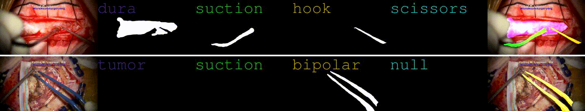

# Neurosurgery Video Dataset

This is a compilation of YouTube videos that has been processed for use in a machine learning dataset.

## TODO
- overfit model on toy dataset

# License
## Data
Video data is property of the respective authors.

## Code
All code in this repository is released under [MIT](LICENSE-MIT) / [Apache 2.0](LICENSE-Apache) dual license, which is extremely permissive. Please open an issue if somehow these terms are insufficient.
