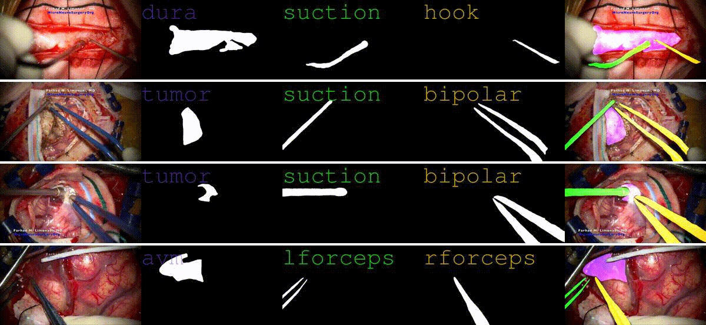

# Neurosurgery Video Dataset

This is a compilation of YouTube videos that has been processed for use in a machine learning dataset. The goal is to facilitate the creation of tools that provide per-pixel labels for features ranging from the surgeon's tools to the patient's tissues. I think such tools have the potential to greatly enhance the value of surgical e-Shadowing, giving students the ability to click parts of the video itself to get more information about the anatomy. This feature would go well with [e-Shadowing Transcriber](https://github.com/thavlik/transcriber), which automates the retrieval of supplementary materials.

## TODO
- label more frames
- overfit model on toy dataset
- create a frame-filter model using [t4vd](https://github.com/thavlik/t4vd)
- train a variational auto-encoder on the t4vd-filtered frames
- determine if the VAE improves data efficiency
- evaluate amazon mturk with this project's data

## Related projects
- [e-Shadowing Transcriber](https://github.com/thavlik/transcriber): an application for enhancing the medical e-Shadowing experience
- [thavlik portfolio](https://github.com/thavlik/machine-learning-portfolio): my showcase of medical software projects, of which this repository is a part

## License
### Data
Video data is property of the respective authors:
- [Dr. Farhad Limonadi (MicroNeuroSurgeryOrg)](https://www.youtube.com/@MicroNeuroSurgeryOrg/)

### Code
All code in this repository is released under [MIT](LICENSE-MIT) / [Apache 2.0](LICENSE-Apache) dual license, which is extremely permissive. Please open an issue if somehow these terms are insufficient.
